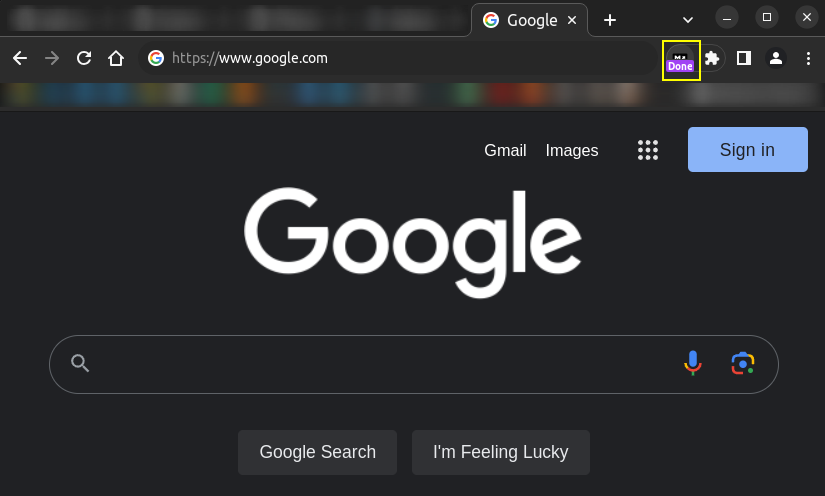
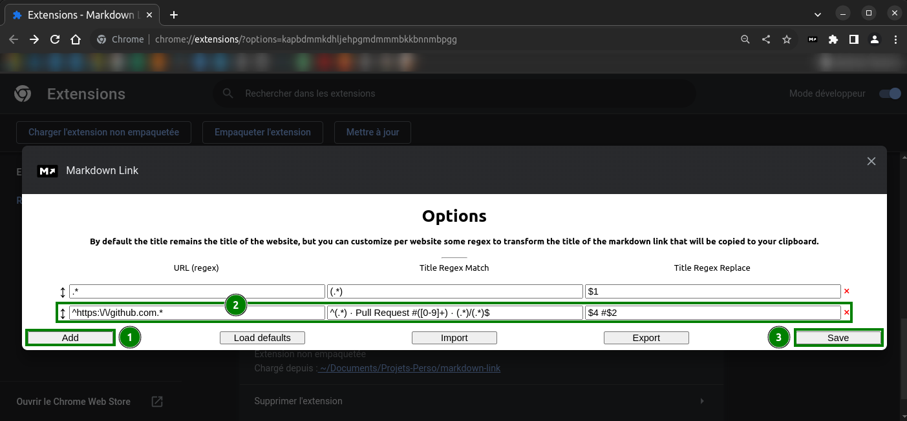

# Markdown Link Generator

Generate markdown link of current tab with one click and/or a keyboard shortcut.

## Installation

1. Pull the project
2. Go to <chrome://extensions/> (enable Developer mode) and load unpacked extension

## Usage



Assume you are on <https://google.com/>. When you click the extension button or use a defined keyboard shortcut, the following markdown text will be copied into your clipboard:

``` markdown
[Google](https://www.google.com/)
```

The link text is generated from current tab title.

Use `Alt` + `F` To as a shortcut to activate this action.
(You can change this key binding in <chrome://extensions/>).

## Configuration

You can configure some custom settings to transform with regex the link title for a specifc URL.

For example: with the following URL <https://github.com/wdhongtw/markdown-link/pull/1>.
By default, this will generate the following markdown link:

```markdown
[add configurable regex options by JayBeeDe · Pull Request #1 · wdhongtw/markdown-link](https://github.com/wdhongtw/markdown-link/pull/1)
```

You can configure a title formatting in order to achieve this markdown link for any pull request from <https://github.com/>:

```markdown
[markdown-link #1](https://github.com/wdhongtw/markdown-link/pull/1)
```



Go to the extension options, click `Add`, and add the following values:
|URL (regex)|Title Regex Match|Title Regex Replace|
|-----------|-----------------|-------------------|
|`^https:\/\/github.com.*`|`^(.*) · Pull Request #([0-9]+) · (.*)/(.*)$`|`$4 #$2`|

Click `Save`.

## Reference

- [What are extensions? - Google Chrome](https://developer.chrome.com/extensions)
- [Sample Extensions - Google Chrome](https://developer.chrome.com/extensions/samples#search:)
- [Clipboard Copy / Paste on Content script (Chrome Extension) - Stack Overflow](https://stackoverflow.com/questions/25622359/clipboard-copy-paste-on-content-script-chrome-extension)
- [dcurtis/markdown-mark: Use this mark to identify Markdown.](https://github.com/dcurtis/markdown-mark)
- [Pitmairen/selection-search: Search extension for the chrome web browser](https://github.com/Pitmairen/selection-search)
